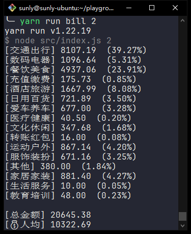

# 平摊账单费用

根据提供的支付宝账单和微信账单，计算每个人的平摊费用并生成总的账单明细文件

## 安装

```bash
yarn install
```

## 使用方法

### 准备账单

在支付宝账单页面，导出**支付宝账单**，放在项目根目录，重命名`alipay.csv`

在微信账单页面，导出**微信账单**，放在项目根目录，重命名`wechat.csv`

支付宝和微信的账单文件删除前面的说明内容，**只保留表头和需要进行平摊的费用行**

### 运行脚本

```bash
yarn run bill [人数]
```

将会计算总账单金额和人均账单金额:



并在根目录生成账单明细`bill.xlsx`文件

`bill.xlsx`文件包含：

| 交易时间 | 交易类型 | 交易对象 | 商品 | 金额 |
| -------- | -------- | -------- | ---- | ---- |
|          |          |          |      |      |
